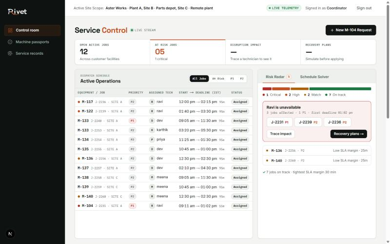
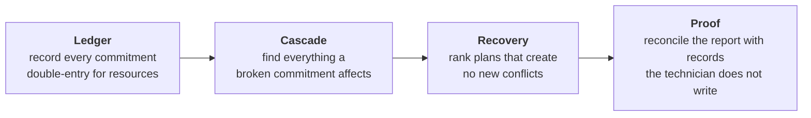
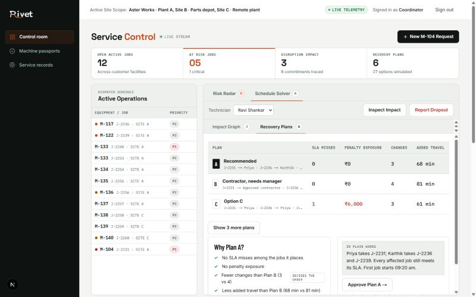
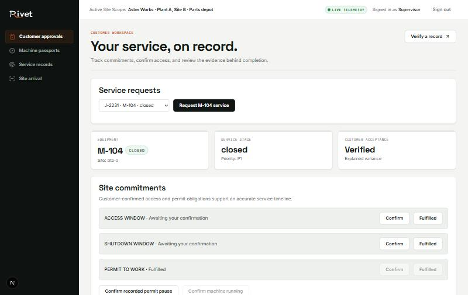
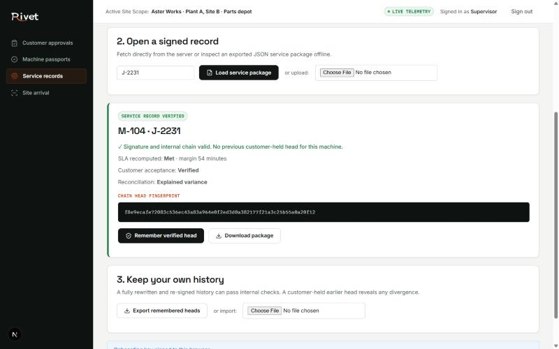
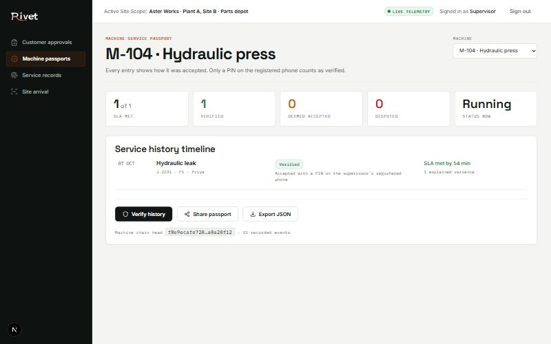
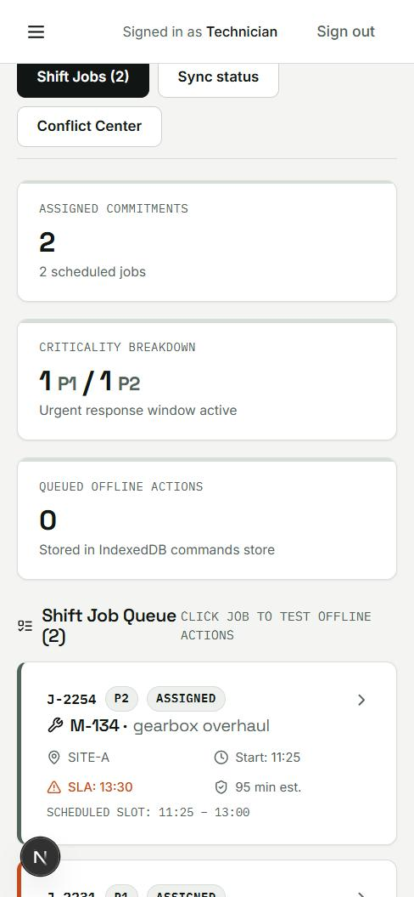
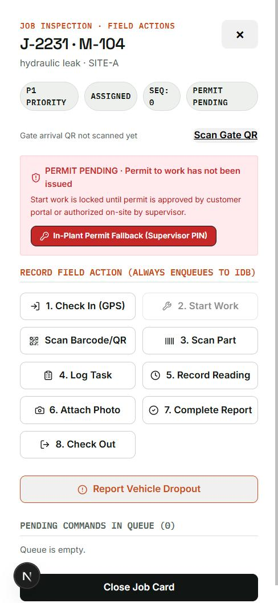
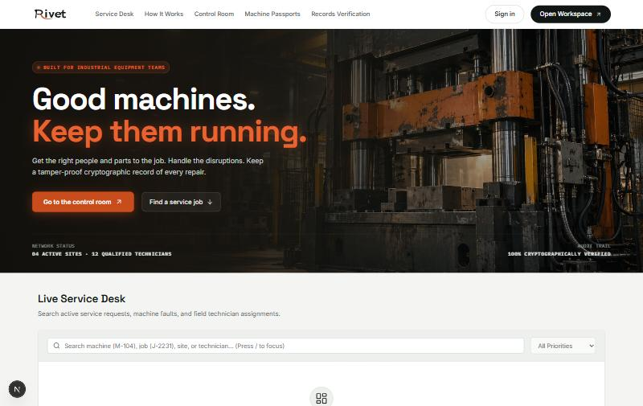
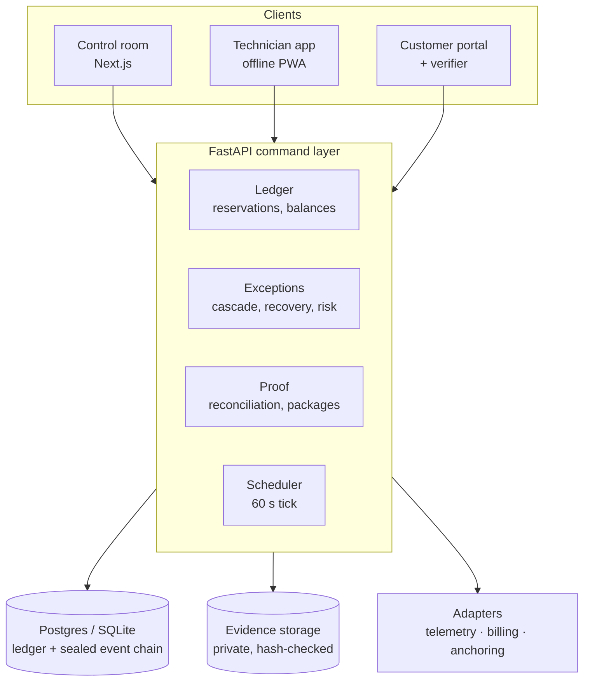

<div align="center">

# Rivet

**Ledger → Cascade → Recovery → Proof**

Rivet manages the commitments behind every industrial service job. When a technician, a part or a permit falls through, it shows everything that breaks, recovers it in one click, and closes the job only on evidence the customer can verify.

*DATAQUEST 3.0 · Round 1 · Track DQBH · Team Burbn.*

[Live demo](https://rivet-lyart.vercel.app) · [API docs](https://rivet-1.onrender.com/docs) · [Submission deck](docs/submission/DATAQUEST_3.0_Rivet.pptx) · [Run it locally](#run-it-locally)



</div>

> The live links run on free hosting tiers. If nobody has used the site for a while, the first request can take about a minute while the API wakes up.

---

## Contents

1. [The problem](#the-problem)
2. [The idea](#the-idea)
3. [One morning with M-104](#one-morning-with-m-104)
4. [Screens](#screens)
5. [How it works](#how-it-works)
6. [Architecture](#architecture)
7. [Repository layout](#repository-layout)
8. [Run it locally](#run-it-locally)
9. [Roles and demo logins](#roles-and-demo-logins)
10. [Testing and evidence](#testing-and-evidence)
11. [API overview](#api-overview)
12. [Hosting](#hosting)
13. [Security notes](#security-notes)
14. [Limits, and where the deck and the code differ](#limits-and-where-the-deck-and-the-code-differ)
15. [Roadmap](#roadmap)
16. [Documentation index](#documentation-index)
17. [Team](#team)

---

## The problem

Multi-site industrial service providers (OEM service arms and AMC contractors) and the plants they serve hit this on every unscheduled breakdown at every site.

| | Today |
| --- | --- |
| **How work runs** | Requests arrive by phone and WhatsApp. Technician schedules live in spreadsheets. Spare parts are "kept aside" in a chat message. |
| **When a technician drops out** | A coordinator calls around, job by job. |
| **How a job is closed** | The technician's own report and a signature on the provider's form. |
| **What goes wrong** | Promises have no owner and no expiry, so nothing can check them. A dropout is fixed one job at a time while its knock-on effects on later jobs, parts and SLAs surface hours later. Completion is self-reported and the history sits in the provider's system, so penalty and warranty disputes turn into arguments. |

The brief's own M-104 scenario describes exactly this: manual checks, sudden dropouts, uncoordinated delays. Even the established field-service suites (ServiceNow, Salesforce, Dynamics 365, IFS) optimise the provider's calendar, and mid-market tools such as Zoho FSM add a customer signature on the provider's report. In all of them the record belongs to the provider.

## The idea

Every technician-hour, spare part, SLA and plant permit is recorded as a **commitment**. Four steps run on one engine:



| Step | What it does |
| --- | --- |
| **Ledger** | Time, parts and tools are balanced journal entries, not an inventory table. A part held for one job cannot be held for another. Customer promises (access windows, shutdown windows, permit to work) are commitments too. |
| **Cascade** | When a commitment breaks, a graph walk finds every job, part hold and SLA that depended on it. |
| **Recovery** | Rivet searches technician combinations jointly across time, parts and SLA penalties, shows ranked plans as a dry run, and refuses options that would create a new conflict. When no plan can save everything, it saves what it can and says what is left. |
| **Proof** | A job closes only when the report agrees with the store issue log, the technician's check-in and the machine's own telemetry. The customer then gets a signed copy of the machine's history that they can verify on their own device, offline. |

Existing field-service systems manage jobs. Rivet manages the commitments behind them.

## One morning with M-104

The demo scenario, with the times the scripted clock uses. P1 request, 4-hour SLA.

| Time | What happens | What Rivet does |
| --- | --- | --- |
| 09:02 | A pressure sensor spikes on M-104, a hydraulic press. | The request is raised. Contract, skills, parts (seal kit HS-40) and tools are checked in under a second. Ravi is assigned and the part is reserved. |
| 10:10 | Ravi reports a vehicle breakdown. | The commitment graph turns red: 3 jobs and 8 commitments are affected. |
| 10:11 | The coordinator opens recovery. | Plans are ranked. Plan A moves J-2231 to Priya, who has the seal kit in her van, with 0 SLA misses. Unsafe options are shown as refused. One click approves it. |
| 11:05 | Priya reaches the plant. | She checks in with a rotating gate QR and GPS. The permit to work is still pending, so **Start Work is locked** and the SLA pauses on the plant's side, with evidence. |
| 11:17 | The plant supervisor fulfils the permit. | Work starts at 11:20. The storekeeper issues the kit; Priya scans it. |
| 12:20 | Priya checks out with before and after photos. | She reports two seal kits against one issued. **Closure is blocked** and the exact checks are listed. |
| 12:24 | She corrects the report to one kit and two O-rings from her van. | The variance is explained by van stock. Telemetry confirms the machine is running in band. |
| 12:26 | The supervisor accepts with PIN and registered device. | The SLA is **met by 54 minutes**, computed from events, not typed. A signed package is issued. |
| after | A rewritten, re-signed history is tried. | The customer's verifier flags it, because it does not extend the chain head the customer already holds. |

`tests/test_thesis.py` drives this whole sequence over HTTP, with no mocks of the domain or the database. See [Run it locally](#run-it-locally) to replay it by hand.

## Screens

| Control room: recovery plans | Customer portal |
| --- | --- |
|  |  |
| The board narrows to a rail while a recovery is open. Plan A, why it ranks first, the plain-words summary and Approve share one view. | What a customer sees: their commitments, the evidence, and an acceptance that reads "Verified · explained variance". Provider planning is not in the payload. |

| Offline verifier | Machine passport |
| --- | --- |
|  |  |
| Checks the provider's Ed25519 signature, the hash chain, the report fingerprint and the SLA recomputed from events, against a key the customer pinned. | The machine's service timeline with how each job was accepted, a chain head and a one-click verify. |

<table>
<tr>
<td width="50%" align="center"></td>
<td width="50%" align="center"></td>
</tr>
<tr>
<td align="center"><b>Technician field app: shift queue.</b> Works offline; every action is queued on the device first.</td>
<td align="center"><b>Job card.</b> Start Work stays locked while the permit is pending; the gate QR and in-plant PIN fallback are one tap away.</td>
</tr>
</table>



| Page | Who it is for | What it does |
| --- | --- | --- |
| `/` | Everyone | Landing page with a live service desk search over jobs, machines and technicians. |
| `/control` | Coordinator, manager, auditor (read-only), admin | Dispatch board, risk radar, schedule solver, map of sites, billing adapter panel, job dossier drawer. |
| `/portal` | Customer supervisor and requester | Request service, confirm access and permits, review the evidence, accept or dispute. |
| `/passport` | Staff and customers | A machine's service history with chain head and verify, share and export. |
| `/verify` | Anyone | Pin the provider key, open a signed record, remember verified heads. See [the verifier](#the-customer-verifier). |
| `/gate` | Site supervisor | Enrol the plant gate key and show the rotating arrival QR. |
| `/tech` | Technician | The offline field app. |
| `/team` | Admin | Link people to sign-ins, scripted demo clock, data reset, demo logins. |

## How it works

### Ledger

- Resources move between named accounts such as `store:site-b:available|HS-40`, `job:J-2231:reserved|HS-40`, `van:priya:stock|O-RING` and `tech:ravi:2026-10-07:free|TIME`. Every movement is a balanced entry, and a test asserts the invariant after each scenario.
- Holds on parts, tools and technician time are atomic. 50 concurrent attempts on the last unit: exactly one wins.
- Every state change is a sealed event in a **per-machine hash chain**. Commands carry an `Idempotency-Key`, scoped to the actor and bound to method, path and body, so a retry never double-books.
- A 60-second scheduler expires unclaimed holds, applies deemed acceptance, and marks technicians unavailable after missed check-ins.

### Cascade

A persisted dependency traversal from a broken commitment to every affected job, part hold and SLA. It is checked against an independent fixed-point oracle across 100 random seeds. On the M-104 fixture, Ravi's dropout affects **3 jobs and 8 commitments**.

### Recovery

- **Joint search.** Rivet enumerates technician combinations for all affected jobs at once, simulating time slots, part holds, travel and SLA penalties. Plans are dry runs against current reservations.
- **Ranking**, in strict order: P1 misses, P2 misses, P3 misses, penalty exposure, commitments changed, added travel, then continuity with technicians who know the machine. The "Why Plan A?" panel names the rule that decided the order.
- **Safety.** Skill level, certificate expiry, travel limit and availability are hard filters, and every refusal is listed with its reason. Plans that use an approved contractor need a service manager to approve. A plan goes stale, and is refused, if reservations changed after it was computed.
- **No all-or-nothing failure.** If no complete plan exists, the solver returns the best *partial* plans (P1 jobs saved first), names each job it could not place, who was ruled out and why, and what a person can do next: offer the customer a later slot (P2 and P3), wait for an unavailable technician, check certifications, or ask the service manager to authorise a contractor or overtime for a P1 job. A dispatcher can approve a partial plan; the rest is flagged `needs_follow_up` and the breach stays `PARTIALLY_RECOVERED`. Details in [docs/recovery.md](docs/recovery.md).
- **Baseline.** [`reports/baseline.json`](reports/baseline.json) compares next-job-only reassignment with joint recovery over 100 seeds: the baseline leaves 66% of affected jobs unserved, joint recovery projects zero SLA breaches. The baseline assumes an unrecovered job stays unserved through its deadline.

### Risk radar

`GET /exceptions/risk` scores every open job from its signals (technician dropout, unassigned, projected SLA miss, low margin, broken commitment) and assigns a **tier**, so a dropout does not push every job it touches to the same score:

| Tier | Rule |
| --- | --- |
| Critical | A projected SLA miss, or any hard signal on a P1 job |
| High | Another hard signal: dropout, unassigned, broken commitment |
| Watch | Only a thin SLA margin |
| On track | No signals |

The control room shows one bar of the whole picture, one card per cause ("Ravi is unavailable · 3 jobs affected · 1 P1") with shortcuts into that technician's impact and plans, and only the remaining at-risk jobs as single lines.

### Proof

1. **Independent records.** The storekeeper's `StoreIssued` event, the technician's `PartScanned`, the van ledger, the gate check-in and the machine's telemetry are written by different people or systems.
2. **Three-way reconciliation.** The report is compared with those records. Two seal kits reported against one issued is *Unexplained* and the job cannot close. A correction backed by van stock is an *Explained variance*, auto-cleared only with backing units and fewer than three auto-clears in the technician's ISO week; otherwise a manager approves.
3. **Authentic evidence.** Before and after photos are uploaded as real bytes, stored privately and hash-checked on every read. Metadata alone does not satisfy mandatory evidence.
4. **Fix confirmation is separate.** Telemetry must show the machine running in band *after* checkout. Without it the acceptance reads "Accepted, fix not independently confirmed".
5. **Acceptance.** Supervisor PIN plus a registered device, against the exact report hash. Email and paper alternatives keep their own labels. Deemed acceptance needs 24 elapsed hours with 12-hour and 20-hour reminders. Disputes name individual lines and hold only those.
6. **SLA from events.** Pauses (plant-side permit delay, for example) are recorded with evidence, and the SLA outcome is recomputed from events, so neither side can dispute the number.
7. **Portable proof.** `/jobs/{id}/package` and `/machines/{id}/package` return `{body, key, signature}`: complete machine events, report fingerprint, acceptance, reconciliation, contract, SLA outcome and customer receipts, signed with Ed25519 over canonical JSON. See [docs/proof-api.md](docs/proof-api.md).

#### The customer verifier

An insider can rewrite an event, re-hash the whole chain and re-sign it, and every internal check will pass. Rivet's answer is that the **customer remembers**. The verifier stores each chain head the customer has accepted (`machine_id`, sequence, hash) and rejects any later history that does not extend it ("History diverges from customer-held acceptance at event N"). The provider key is pinned out of band at onboarding, never taken from a package.

Two verifiers exist: the `/verify` page in the web app and a standalone page that makes no network requests.

```bash
python -m http.server 8090 --directory verifier
# open http://localhost:8090, then go offline
```

The tamper demo produces both a naive edit and the realistic re-sign attack:

```bash
python demo/tamper.py demo/m104_package.json   # writes demo/tampered/naive-edit.json and rewritten-resigned.json
```

A first-time customer with no retained head can verify internal consistency and the signature, but cannot detect a complete rewrite. That is a stated limit, not a bug.

### Offline field app

- Every action (check-in, start work, scan part, log task, record reading, attach photo, report, checkout, vehicle dropout) is written to IndexedDB (`rivet-field-db`) first and replayed in order when the network returns. Replaying twice creates no duplicates, and the server re-validates every action, so the worst case is a rejected action, never a wrong balance.
- A service worker serves the app shell offline (navigation is network-first, assets cache-first). A scoped shift cache holds the technician's own jobs.
- Arrival is proven with a rotating gate QR signed by the site's Ed25519 gate key (30-second windows) plus GPS. Location is recorded only at check-in, check-out and en route.
- Screens: shift queue, job card, barcode scanner, supervisor permit fallback, report screen (checklist, parts, minutes, notes, photos), sync status and conflict center.

### Roles and data trimming

Scope (which sites, which technician) is decided in `api/app/core/auth.py`; which fields come back is decided in `api/app/core/views.py`; the screens follow `web/lib/roles.ts`. The API enforces every rule. Hiding a link is never the only protection. A customer's payload carries no technician ranking, no assignments, no part or time holds, no recovery data and no live event stream. See [Roles and demo logins](#roles-and-demo-logins).

### Adapters

- **Telemetry** is explicitly simulated: `python sim/telemetry.py --status fault` opens the M-104 service, `--status running` confirms the fix.
- **Billing** runs as a separate process that polls the API and drafts invoices from verified jobs (standard part costs, labour at ₹1,500 an hour with a one-hour minimum) into its own SQLite file. The control room has a panel to enable it and list invoices.
- **Anchoring** is registered but planned.

## Architecture



The same database holds the ledger, the events and the idempotency store, which keeps the system to one moving part. Domain code works on an in-memory `LedgerState` and never mutates its input: `apply(state, command) -> (new_state, events)` or a `DomainError`. `store.mutate` loads the state in a transaction, runs the function, and persists the new events and entries; errors roll back. The seam is documented in [contract/README.md](contract/README.md).

| Layer | Technology |
| --- | --- |
| API | Python 3.12, FastAPI, Pydantic 2, SQLAlchemy 2, PyJWT, `cryptography` (Ed25519), httpx, WebSockets |
| Storage | SQLite locally, Postgres (Supabase) hosted, Supabase Storage for evidence photos |
| Auth | Self-signed demo tokens locally; Supabase email sign-in hosted, verified against Supabase's published keys, mapped to a Rivet user that carries the role and site scope |
| Web | Next.js 16, React 19, TypeScript, CSS modules, lucide-react, Leaflet, ZXing (barcode and QR), `idb`, `@supabase/supabase-js` |
| Tests | pytest and Hypothesis; Playwright specs for the web app |
| Hosting | Render (API), Vercel (web), Supabase (database, auth, storage) |

## Repository layout

```text
api/                  FastAPI service
  app/main.py           routers, websocket, health, scheduler loop
  app/core/             auth, role views, store runtime, idempotency, scheduler, clock, storage
  app/modules/ledger/   requests, assignment, reservations, field commands, uploads, demo accounts
  app/modules/exceptions/  cascade, joint recovery, partial plans, risk tiers
  app/modules/proof/    reconciliation, acceptance, signed packages
contract/             shared contract: state, commands, events, canonical hashing, SLA maths,
                      OpenAPI, the M-104 fixture and cross-language hash vectors
web/                  Next.js app
  app/                  control, portal, passport, verify, gate, team, (tech) field app
  components/           plan ranking, risk radar, commitment graph, map, navigation
  lib/                  API client, roles, offline queue/replay/photos, proof verifier
  e2e/                  Playwright specs
adapters/billing/     standalone billing adapter process
sim/telemetry.py      simulated machine feed
seed/history.py       30 days of sealed historical jobs
demo/                 headless 9-step runner, tamper attack generator, sample package
verifier/             standalone offline verifier page
scripts/              run-local, check, OpenAPI export, fixture baking
tests/                ledger, exceptions, proof, sync, hosting, roles, demo accounts, thesis
reports/baseline.json recovery baseline over 100 seeds
docs/                 hosting, roles, recovery, proof API, status board, submission deck, screenshots
```

## Run it locally

You need Python 3.12 and Node.js 22 or newer. From the repository root:

```powershell
python -m venv .venv
.venv/Scripts/python.exe -m pip install -r api/requirements.txt
cd web
npm ci
cd ..
./scripts/run-local.ps1 api        # API on http://127.0.0.1:8000
```

In a second terminal:

```powershell
./scripts/run-local.ps1 web        # web app on http://localhost:3000
```

Not on Windows? `make api` starts the API (`uvicorn api.app.main:app --port 8000`), and `npm run dev` in `web/` starts the app. Set `ENV=demo` and `NEXT_PUBLIC_AUTH_MODE=demo` so the built-in demo sign-in is used even if Supabase values are present.

Open http://localhost:3000/control, choose **Sign in**, then either click one of the **Enter as…** buttons (the menu carries a demo-only notice) or select a role, press **Request code** and **Continue** (demo mode fills the development code `246810`).

- The API's interactive docs are at http://127.0.0.1:8000/docs.
- Local data persists in `data/local-demo.db` and startup does not reset it. Keep the signing key when you keep the database, because customers pin its public key. Private evidence and signing keys are excluded from Git.
- `docker compose up --build` provides Postgres, API and web with persistent volumes. This path is supplied but was **not verified**: Docker was unavailable on the build machine.

### Replay the M-104 story by hand

1. Sign in as **coordinator** and click **New M-104 Request**. In the drawer, assign Ravi.
2. Open the **Schedule Solver** tab, pick Ravi and press **Report Dropout**. Read the impact graph, then the recovery plans.
3. Approve Plan A. Priya takes J-2231.
4. As an **admin**, use **Team access** to move the scripted clock (09:02 to 12:26) and to reset the demo data afterwards.
5. As **supervisor**, enrol the gate key on `/gate`, and confirm and fulfil the permit on `/portal`.
6. As **technician Priya** in `/tech`, check in, try Start Work (locked), then start work once the permit is fulfilled, scan the part, attach photos, check out and submit a report.
7. Feed the machine's reading with `python sim/telemetry.py --status running`.
8. As supervisor, accept the report on `/portal`, then open `/verify`, pin the key and load J-2231.

### Headless runner and scripts

```bash
python demo/demo.py --until 9        # the nine steps above, in process
python demo/demo.py --pause          # stop after each step for a rehearsal
python scripts/export_openapi.py     # regenerate contract/openapi.json
python -m adapters.billing.main --poll   # run the billing adapter against the API
```

> **Heads-up:** `demo/demo.py` resets the database that `DATABASE_URL` points to before it runs. Point it at a scratch database (for example `DATABASE_URL=sqlite:///scratch.db`) if you want to keep your local demo data.

`scripts/bake_fixture.py` turns the current state of a local database (for example 30 days of history) into a new starting seed, so that **Reset** restores the history too. See its docstring.

## Roles and demo logins

| Role | Lands on | Can change things | Sees |
| --- | --- | --- | --- |
| admin | Control room | Everything | All, plus Team access and the field app |
| coordinator | Control room | Dispatch, requests, recovery plans | Everything |
| manager | Control room | The same, plus approvals that need a manager | Everything |
| auditor | Control room (read-only) | Nothing | Reads the whole record |
| supervisor (customer site lead) | Customer approvals | Confirms access and permits, accepts reports, enrols the gate | Customer view |
| requester (customer) | Customer approvals | Requests service, confirms, disputes | Customer view |
| storekeeper | Service records | Issues parts through the API | No jobs (no stores screen yet) |
| technician | Field app | Own job actions, report, evidence | Own jobs only, no dispatcher ranking |

Signed-out visitors see only the verifier. Full detail in [docs/roles.md](docs/roles.md).

Local demo accounts are `coordinator`, `manager`, `supervisor`, `requester`, `storekeeper`, `auditor`, `admin` and the technicians `ravi`, `priya`, `karthik`, `arjun`, `meena`, `dev` and an approved `contractor-1`. The seeded approval PINs and the `246810` code are development fixtures only. The code is accepted in `demo` and `test` mode and nowhere else.

## Testing and evidence

```powershell
./scripts/check.ps1 all          # the whole suite
./scripts/check.ps1 thesis       # the HTTP lifecycle
./scripts/check.ps1 openapi      # regenerate and check the contract
cd web ; npm run typecheck ; npm run build
```

Or `make thesis`, `make test-ledger`, `make test-exceptions`, `make test-proof`, `make test-sync` for one area at a time.

**117 backend tests** are collected; 114 run in a few seconds and the other three (the history seeder and the demo runner) take longer. Next.js type checking and the production build pass. Playwright specs for the field app, the report screen, sync and conflict screens, the map and the billing panel are in `web/e2e/`; they need `npx playwright install` and a running API, and have not been run in CI.

| What is proven | Where |
| --- | --- |
| Request to recovery over HTTP, real balances, plan approval, reservations kept | `tests/test_thesis.py` |
| False closure refused, corrected report, acceptance, clean verification | `tests/test_thesis.py` |
| A re-hashed, re-signed history passes the pinned key and **fails** the customer-held head | `tests/test_thesis.py` |
| Role and site isolation | `tests/test_thesis.py`, `tests/test_role_views.py` |
| The cascade equals an independent oracle over 100 random seeds | `tests/exceptions/test_domain.py` |
| The joint solver equals an exhaustive schedule oracle over 100 seeds | `tests/exceptions/test_domain.py` |
| Partial plans, blockers, next steps, approval of a partial plan | `tests/exceptions/test_partial_recovery.py` |
| Risk tiers | `tests/exceptions/test_risk_tiers.py` |
| 50 concurrent holds on the last part: exactly one succeeds | `tests/ledger/test_ledger.py` |
| Offline replay run twice produces no duplicates | `tests/sync/` |
| Hash vectors agree across Python and JavaScript | `tests/test_contract.py` |
| Hosting behaviour, Supabase token verification, demo accounts and entry | `tests/test_hosting.py`, `tests/test_supabase_auth.py`, `tests/test_demo_accounts.py`, `tests/test_demo_controls.py` |
| The nine-step demo runs end to end in under 60 seconds | `tests/test_demo_runner.py` |

On the M-104 fixture the joint solver returns six ranked plans after examining 27 combinations in about 4 ms (in process, excluding HTTP and the database).

## API overview

All mutation routes accept an `Idempotency-Key`. Errors come back as `{code, message}` with a matching HTTP status. The generated contract is [contract/openapi.json](contract/openapi.json).

| Area | Routes |
| --- | --- |
| Health | `GET /health` · `GET /health/db` · `GET /.well-known/rivet-keys.json` |
| Auth | `POST /auth/otp` · `/auth/token` · `/auth/refresh` · `GET /auth/me` · `GET/POST /auth/demo-entry` |
| Requests and jobs | `POST /requests` · `GET /requests/{id}` · `POST /requests/{id}/approve` · `GET /jobs` · `GET /jobs/{id}` · `POST /jobs/{id}/assign` · `POST /jobs/{id}/actions/{kind}` |
| Reservations | `POST /commitments/hold` · `/commitments/{id}/release` · `/commitments/{id}/transfer` · `/customer-commitments/{id}/{action}` · `/pauses/{id}/confirm` · `/pauses/{id}/contest` |
| Field | `GET /devices/{id}/shift-cache` · `POST /devices/{id}/commands` · `POST /jobs/{id}/checkin` · `/checkout` · `/evidence` · `/report` · `POST /evidence/uploads` · `GET /evidence/uploads/{id}` · `POST /sites/{id}/gate-key` · `POST /stores/issue` |
| Exceptions | `GET /exceptions/risk` · `GET /exceptions/impact/{tech}` · `GET /exceptions/plans/{tech}` · `POST /exceptions/plans/{tech}/refresh` · `POST /exceptions/dropout/{tech}` · `POST /technicians/{tech}/dropout` · `POST /plans/{id}/approve` · `GET /breaches/{id}/impact` · `GET /breaches/{id}/plans` |
| Proof | `GET /jobs/{id}/reconciliation` · `POST /jobs/{id}/variance` · `/accept` · `/accept-alternative` · `/dispute` · `/machine-running` · `GET /jobs/{id}/package` · `GET /machines/{id}/package` · `GET /machines/{id}/passport` · `POST /proof/reminders` · `POST /telemetry` |
| Dashboard and live | `GET /dashboard/summary` · `GET /subscriptions/{name}/events` · WebSocket `/ws` (falls back to polling every 3 seconds) |
| Admin | `GET/POST /admin/clock` · `POST /admin/reset` · `GET /admin/users` · `POST /admin/users/{id}/link` · `POST/DELETE /admin/demo-accounts` · `GET /adapters` · `POST /adapters/{name}/enable` |

## Hosting

The split in production: **Render** runs the FastAPI container (one instance, because the scheduler runs in-process), **Supabase** supplies Postgres, email sign-in and the private `evidence` bucket, and **Vercel** serves the web app, proxying `/api` to Render. Everything has a free tier. The full walkthrough, including the free-plan caveats, is in [docs/hosting.md](docs/hosting.md).

| Variable | Where | Purpose |
| --- | --- | --- |
| `ENV` | API | `demo` or `test` enable the self-signed demo login. Anything else is hosted and accepts Supabase sign-ins only. |
| `DATABASE_URL` | API | Postgres connection string. SQLite is used when unset. |
| `RIVET_SIGNING_KEY` | API | Base64 of 32 random bytes. Generate once and never change it, or every pinned customer key breaks. |
| `RIVET_KEY_ID` | API | Key label, for example `k-2026-01`. |
| `JWT_SECRET` | API | Signs the demo tokens. |
| `CORS_ORIGINS` | API | Comma-separated web origins. |
| `SUPABASE_URL` | API and web | Project address; the API fetches Supabase's published keys from it. |
| `SUPABASE_SERVICE_KEY` | API only | Server-side admin access (evidence storage, demo accounts). Never in the browser. |
| `BOOTSTRAP_ADMIN_EMAIL` | API | The address that maps to the `admin` user, so a fresh deployment cannot lock itself out. |
| `EVIDENCE_BUCKET` | API | Storage bucket name, `evidence`. |
| `DEMO_CONTROLS` | API | `1` puts the site in demo mode: anyone can enter as the demo roles from the Sign in menu (no account), with a demo-only notice, and admins get the scripted clock and data reset. Demo phase only; leave unset for real use. |
| `DEMO_ENTER_ADMIN` | API | `1` adds Admin to the open demo entry. Unset it afterwards. |
| `RIVET_FIXTURE` | API | Path to a baked seed, so **Reset** restores history too. |
| `API_URL` | Web, **at build time** | Where the Next.js proxy forwards `/api`. Next.js bakes rewrite targets into the build. |
| `NEXT_PUBLIC_SUPABASE_URL`, `NEXT_PUBLIC_SUPABASE_PUBLISHABLE_KEY` | Web | Public values; see `web/.env.example`. |
| `NEXT_PUBLIC_AUTH_MODE` | Web | `demo` forces the built-in demo sign-in. |

A `keep-warm` GitHub Action pings the API, database and web app every five minutes so a free Render instance does not sleep before a demo.

## Security notes

- **Authentication.** Hosted sign-in is Supabase email codes, verified against Supabase's published signing keys. A valid Supabase login is not enough: the address must be linked to a Rivet user, which carries the role and site scope; otherwise the API returns `NOT_PROVISIONED`.
- **Authorisation on the server.** Every route declares its roles; scope (sites, own jobs) is checked per record; customer payloads are trimmed server-side. The auditor role is read-only.
- **Secrets.** The service key, signing key and JWT secret live only on the API host. Private evidence and signing keys are excluded from Git.
- **Database.** On Postgres, startup enables row-level security with no policies on every Rivet table, so Supabase's public REST keys cannot read them. The audit tables (events and ledger entries) are append-only, enforced by database triggers on both SQLite and Postgres.
- **Evidence.** Files go to a private bucket and are checked against the ledger hash on every read.
- **Idempotency.** Retried commands cannot double-apply.
- **Demo mode is open by design.** While `DEMO_CONTROLS=1`, anyone who can open the site can enter as a demo role from the Sign in menu. The menu, a banner and a "DEMO ONLY" badge say so on every page. Demo tokens last 8 hours, name one role, are signed with the server's secret, stop working the moment the switch is turned off, exclude admin unless `DEMO_ENTER_ADMIN=1`, and are limited to 20 attempts a minute per address. Real Supabase sign-ins are unchanged. Turn the switch off when the demo phase ends.
- **Privacy.** The audit trail stores only a hash of an email address. Technician location is recorded only at check-in, check-out and en route.

## Limits, and where the deck and the code differ

Rivet is a hackathon build. This section says plainly what is and is not done, including where the [submission deck](docs/submission/DATAQUEST_3.0_Rivet.pptx) says more than the code does.

| The deck says | What the repository does |
| --- | --- |
| Recovery uses a SciPy solver. | Recovery is a **bounded enumeration** with a time budget, checked against an exhaustive oracle. There is no SciPy dependency. |
| A double-entry ledger under PostgreSQL row locks. | Mutations serialise a snapshot transaction; on Postgres a tenant-row lock is used rather than per-balance row locks. The Postgres path has been tested against fakes only. |
| 12 dependent commitments walked. | The shipped fixture reports 8 commitments across 3 jobs, and the UI shows that number. |
| Blast radius in under 5 seconds. | The solver takes milliseconds in process, but no test asserts a 5-second bound. The only timing assertion is the demo runner's 60-second limit for all nine steps. |
| `make thesis` runs the oracle, the concurrency, the replay and the tamper checks. | `make thesis` runs the HTTP lifecycle and the tamper attack. The oracle, concurrency and replay checks run under `make test-exceptions`, `test-ledger` and `test-sync`. |
| An optional LLM writes one cached explanation per breach. | There is no LLM in this build. The "Why Plan A?" text comes from the solver's own ranking rules. |
| The stack runs in three containers on one VM. | A `docker-compose.yml` is supplied but unverified. The deployed version uses Render, Vercel and Supabase free tiers. |

Other open items:

- **Not built:** a storekeeper stores screen (that role only sees Service records); the **Log Task** button in the field app is a stub; phone OTP (the provider is off, and technicians on shared phones would need an SMS provider).
- **Scoping:** customers see every job at their site, not only their company's.
- **Brute force:** there is no lockout on repeated wrong PINs yet.
- **Concurrency and scale:** event sealing is inline, the scheduler assumes one instance, and large-volume scheduling, PostgreSQL concurrency, backup and restore and production authentication have not been exercised.
- **Evidence is not truth.** Byte integrity does not show that a photograph depicts real work. A registered device ID plus PIN is a prototype binding, not hardware attestation. Collusion raises the cost of lying; it does not prove truth.
- **The seed.** The shipped seed and verifier memory were generated with a throwaway key. On a hosted deployment, re-sign them with the hosted `RIVET_SIGNING_KEY` before a demo or a customer's verifier will report a key change.
- **Photos through Vercel** are limited to 4.5 MB per request.
- **Websockets** are not proxied by Vercel, so the hosted control room polls every 3 seconds.
- **Telemetry** is simulated. Rotation and revocation of provider keys, real mail and SMS delivery, and customer-operated sensors are later integration work.
- **Out of scope:** native apps, ERP integration, multi-stop routing, predictive failure models and real sensors.

The [implementation status board](docs/implementation-status.md) tracks the acceptance gates.

## Roadmap

From the submission deck:

- A verify-mode overlay for teams already on ServiceNow or Zoho FSM.
- WhatsApp intake for Indian field teams.
- Plant-controlled evidence (gate logs, plant telemetry).
- Domain packs for lifts, HVAC and solar O&M.
- Invoice financing on verified receivables via TReDS.

Indicative economics from the deck: one 2 vCPU / 4 GB VM (about ₹2,000 to ₹3,500 a month) against an illustrative ₹600 per technician per month, so a 100-technician provider brings ₹60,000 of revenue. These are estimates, not measurements.

## Documentation index

| Document | Contents |
| --- | --- |
| [docs/submission/DATAQUEST_3.0_Rivet.pptx](docs/submission/DATAQUEST_3.0_Rivet.pptx) | The Round 1 submission deck |
| [docs/hosting.md](docs/hosting.md) | Render, Supabase and Vercel setup, login linking, demo mode, free-plan notes |
| [docs/roles.md](docs/roles.md) | What each role sees and can change |
| [docs/recovery.md](docs/recovery.md) | Recovery planning, partial plans, the risk radar |
| [docs/proof-api.md](docs/proof-api.md) | Store issue, evidence, closure, acceptance and portable proof |
| [docs/implementation-status.md](docs/implementation-status.md) | Gate board and known gaps |
| [contract/README.md](contract/README.md) | The shared contract and the runtime seam |
| [verifier/README.md](verifier/README.md) | The standalone offline verifier |
| [docs/for-person-b.md](docs/for-person-b.md) | Integration notes for the technician app, billing and demo lane |

## Team

**Burbn.** · DATAQUEST 3.0, Round 1 · Track **DQBH**

| Member |
| --- |
| Aakash A |
| Abdul Haashir |
| Lakshita V |
| Shyam Ganesh |

Aakash owned the contract, the backend engines, the control room, the customer portal, the verifier and hosting. Abdul Haashir owned the technician app, the billing adapter, the seed history and the demo runner.
